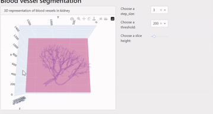

# Hacking the human Vasculature in 3D, visualiser

## Description
During participating in the SenNet + HOA competition on kaggle, I created a dash app to visualise results.
This repository contains the code for this dash app and the inference and training model that I used.

## Installation
- pip install -r requirements.txt
- You can find the data at https://www.kaggle.com/competitions/blood-vessel-segmentation

## Features
- Dash app which takes in segmentations and recreates a 3d volume using marching cubes.
- Training and inference scripts, which perform segmentation task on TIFF images.

## Credits
The competition organisers, kaggle and everyone who participated.
https://www.kaggle.com/competitions/blood-vessel-segmentation
https://www.kaggle.com/code/yoyobar/2-5d-cutting-model-baseline-training/notebook
https://dash.gallery
https://en.wikipedia.org/wiki/Marching_cubes

## License
This project is licensed under the terms of the MIT license.

## Contact
[Thierry Ars](https://github.com/BitorqubitT)